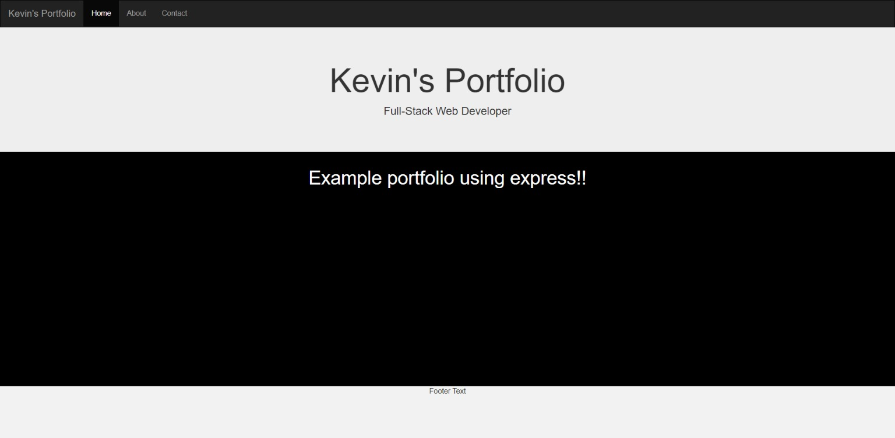

# Express Portfolio


### Installation and use

***Prerequisite:***

Clone this repository:

```
git clone https://github.com/KevMcCall/Express-Portfolio.git
```

Install npm packages:

```
npm i express
npm i bootstrap
npm init -y
npm i
```

Start working:

```
npm start
```


### npm start works because we have nodemon installed globally.

We then add it to the package.json scripts:
```
"scripts": {
    "start": "nodemon server.js"
  }
```

### Screenshots



